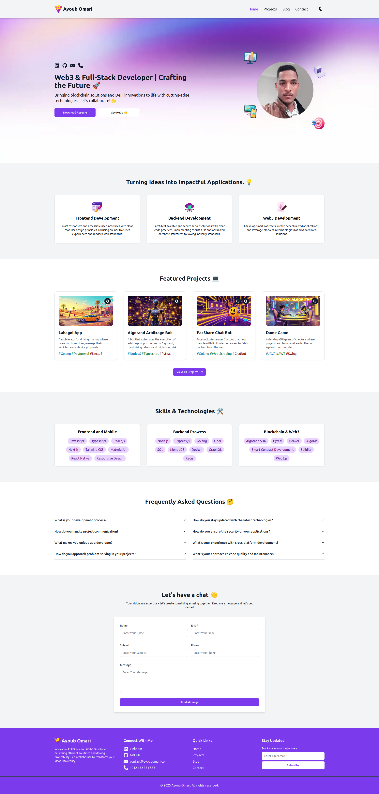
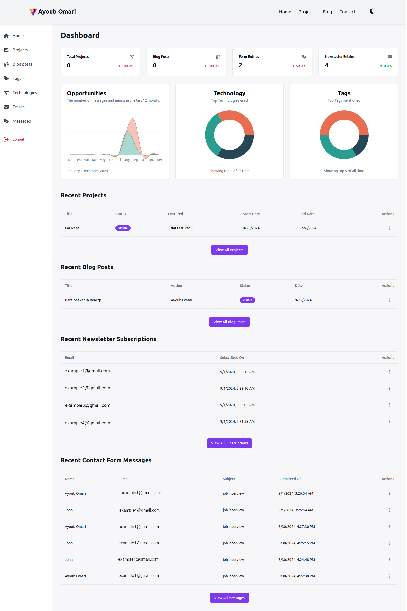
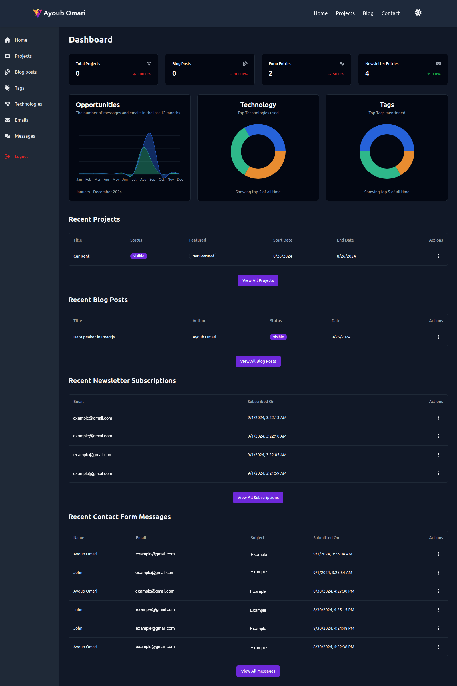
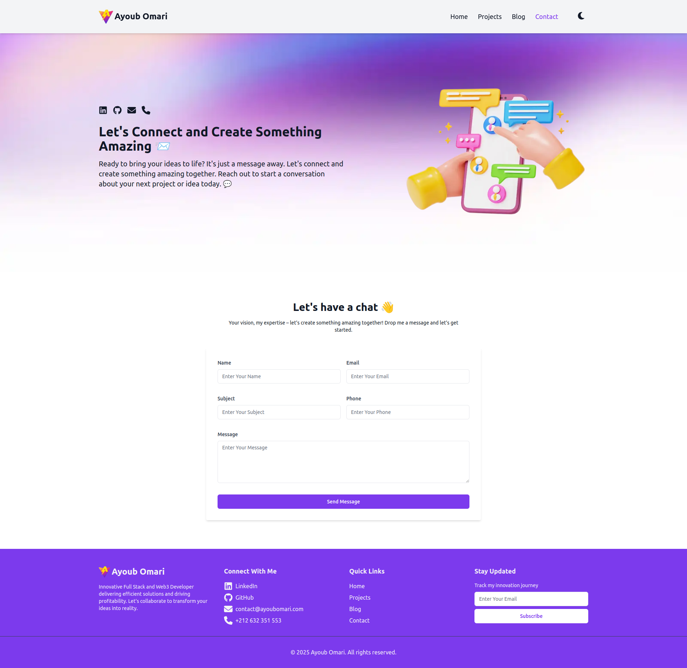

# Modern Portfolio With Blog And Projects Showcase

🌐 [Live Demo](https://www.ayoubomari.com)

<div align="center">
  
</div>

<div align="center">
  
  
  
  
</div>

## ✨ Features

- 📝 **Blog System** - Create and manage blog posts with markdown support
- 🎨 **Project Showcase** - Display your projects with detailed descriptions
- 📬 **Contact Form** - Professional contact form with email notifications
- 📊 **Admin Dashboard** - Comprehensive dashboard for content management
- 📱 **Responsive Design** - Fully responsive across all devices
- 🌙 **Dark Mode** - Toggle between light and dark themes
- 📊 **Analytics Integration** - Track visitor engagement
- 📨 **Newsletter System** - Manage email subscriptions

## 🖥️ Preview

<div align="center">
  
  
  <br><br>
  
</div>

## 🚀 Tech Stack

- **Framework:** Next.js 14
- **Language:** TypeScript
- **Styling:** Tailwind CSS
- **Database:** PostgreSQL with Drizzle ORM
- **Authentication:** Lucia Auth
- **Email:** Nodemailer
- **UI Components:** Shadcn UI
- **Charts:** Recharts
- **Markdown:** React Markdown
- **Icons:** Lucide React, Font Awesome

## 📦 Installation

1. Clone the repository:
```bash
git clone https://github.com/ayoubomari/portfolio.git
cd portfolio
```

2. Install dependencies:

```bash
npm install
```

3. Copy the environment variables:
```bash
cp .env.example .env
```

4. Update the .env file with your configuration:
```env
PORT=3000
DATABASE_HOST=HOST
DATABASE_USERNAME=USERNAME
DATABASE_PASSWORD=PASSWORD
DATABASE_NAME=DB_NAME
SECRET_KEY="#YOUR_SECRET_KEY"
NEXT_PUBLIC_SITE_URL=http://localhost:3000
NEXT_PUBLIC_API_URL=http://localhost:3000/api

SMTP_HOST="smtp.email.com"
SMTP_PORT="465"
SMTP_EMAIL="email@example.com"
SMTP_PASSWORD="PASSWORD"
RECEIVER_EMAIL="email@example.com"
```

5. Initialize the database:
```bash
npm run generate  # Generate database migrations
npm run push     # Push migrations to database
node scripts/initialisedb.js  # Create admin user
```

6. Start the development server:
```bash
npm run dev
```

## 📁 Project Structure

```
.
├── app/                # Next.js app directory
│   ├── api/           # API routes
│   ├── blog/          # Blog pages
│   ├── dashboard/     # Admin dashboard
│   └── projects/      # Projects pages
├── components/        # React components
│   ├── forms/         # Form components
│   ├── layouts/       # Layout components
│   └── ui/            # UI components
├── db/               # Database configuration
├── lib/              # Utility functions
└── public/           # Static assets
```

## 🛠️ Development
```bash
npm run dev          # Start development server
npm run build        # Build for production
npm run start        # Start production server
npm run lint         # Run ESLint
```

## 🔑 Environment Variables

| Variable | Description |
|----------|-------------|
| `PORT` | Server port number |
| `DATABASE_HOST` | PostgreSQL host |
| `DATABASE_USERNAME` | Database username |
| `DATABASE_PASSWORD` | Database password |
| `DATABASE_NAME` | Database name |
| `SECRET_KEY` | Authentication secret key |
| `SMTP_HOST` | SMTP server host |
| `SMTP_PORT` | SMTP server port |
| `SMTP_EMAIL` | SMTP email address |
| `SMTP_PASSWORD` | SMTP password |
| `RECEIVER_EMAIL` | Contact form recipient email |

## 👤 Admin Setup

After setting up your environment variables and database, run the following command to create an admin user:

```bash
node scripts/initialisedb.js
```

## 🚀 Deployment

1. Build the application:
```bash
npm run build
```

2. Start the production server:
```bash
npm run start
```

## 🤝 Contributing

Contributions, issues, and feature requests are welcome!

## 📝 License

This project is licensed under the MIT License - see the LICENSE file for details.